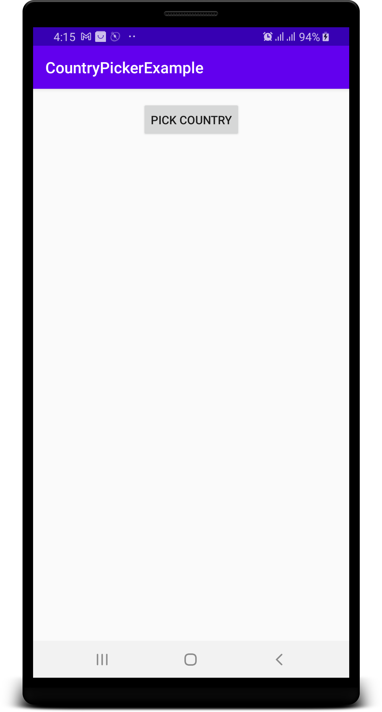
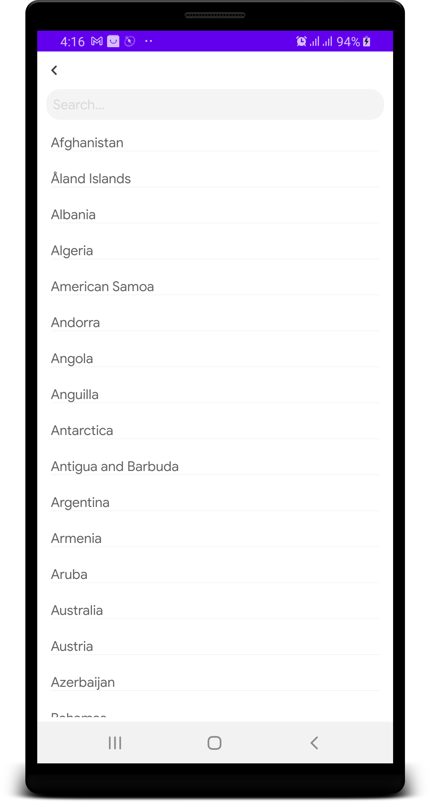
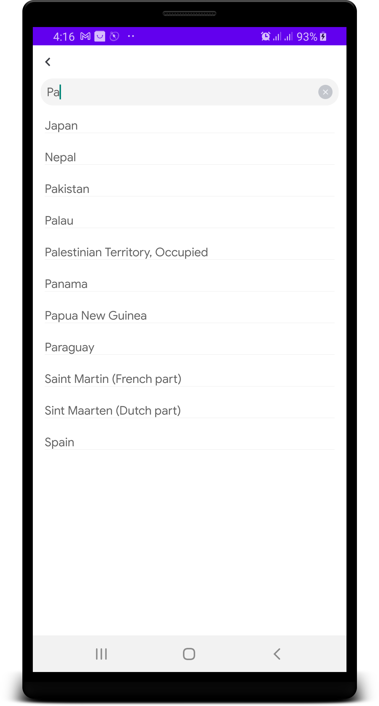
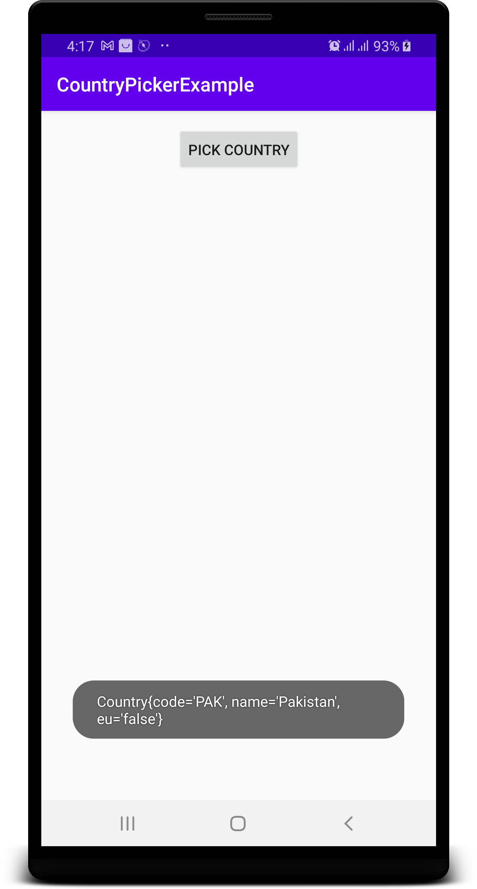

# CountryPicker
Country Picker is an android library which provides an easy way to search and select country(country name, 3 digit code: Alpha3).
# Introduction
CP gives professional touch to your well designed form like login screen, sign up screen, edit profile screen.
# Screenshots




# How to add to your project
1.Add jitpack.io to your root build.gradle file:
```
allprojects {
    repositories {
        jcenter()
        maven { url "https://jitpack.io" }
    }
}
```
2.Add library to your app build.gradle file then sync
```
dependencies {
	        implementation 'com.github.farrakhj:CountryPicker:1.0.0'
}
```
3. Start Activity in Activity / Fragment
```
startActivityForResult(new Intent(MainActivity.this, CountriesActivity.class), 101);
```
4. Receive country DTO object in onActivityResult
```
@Override
    protected void onActivityResult(int requestCode, int resultCode, @Nullable Intent data) {
        super.onActivityResult(requestCode, resultCode, data);

        if(resultCode == Activity.RESULT_OK) {
            if(requestCode == 101) {
                if(data==null || !data.hasExtra(CountriesActivity.COUNTRY))
                    return;

                Country country = (Country) data.getSerializableExtra(CountriesActivity.COUNTRY);

                Toast.makeText(MainActivity.this, country.toString(), Toast.LENGTH_LONG).show();
            }
        }
    }
```
# License
Copyright (C) 2021 farrakhj

Licensed under the Apache License, Version 2.0 (the "License");
you may not use this file except in compliance with the License.
You may obtain a copy of the License at

   http://www.apache.org/licenses/LICENSE-2.0

Unless required by applicable law or agreed to in writing, software
distributed under the License is distributed on an "AS IS" BASIS,
WITHOUT WARRANTIES OR CONDITIONS OF ANY KIND, either express or implied.
See the License for the specific language governing permissions and
limitations under the License.
